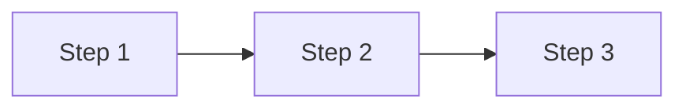

# Learning — research a topic and produce a comprehensive reference document

Take a topic from the user, interactively refine it, research it via web search, and assemble a thorough markdown document with references. Output goes to `learning/` in `/Users/andrewgetz/tars-vault`.

## Phase 1: Interactive Brainstorm

1. Take the user's topic/idea from the skill argument.
2. Ask 2-3 clarifying questions using `AskUserQuestion`:
   - What's the intended use case / why are you learning this?
   - What's your current knowledge level on this?
   - Any specific sub-topics or angles to focus on?
3. Synthesize answers into a **learning plan** — a structured outline of 4-6 key areas to research.
4. Present the plan to the user for confirmation before proceeding. If they want changes, adjust and re-confirm.

## Phase 2: Research (parallel sub-agents)

1. For each key area in the learning plan, spawn a **Haiku sub-agent** via the Task tool with:
   - `subagent_type: "general-purpose"`
   - `model: "haiku"`
2. Each sub-agent should:
   - Use `WebSearch` to find 3-5 high-quality sources (prefer official docs, academic papers, reputable tech blogs)
   - Use `WebFetch` to pull and extract relevant content from the top 2-3 results
   - Return structured data: **key findings**, **source URLs**, **source titles**, **relevant quotes**, and **code examples** where applicable
3. Spawn agents **in parallel** (up to 4 at a time) for speed.
4. Collect all results from the sub-agents before proceeding.

**Sub-agent prompt template:**

> Research the following topic area: "[area title]"
>
> Context: This is part of a larger learning document about "[main topic]". The user's goal: "[use case from Phase 1]".
>
> Instructions:
> 1. Use WebSearch to find 3-5 high-quality sources about this area. Prefer official documentation, academic papers, and established tech blogs over random posts.
> 2. Use WebFetch on the top 2-3 results to extract detailed content.
> 3. Return your findings in this exact format:
>
> ## Key Findings
> - [Finding 1]
> - [Finding 2]
> - ...
>
> ## Code Examples
> [Include any practical code snippets found, with language tags]
>
> ## Sources
> 1. [Source Title](URL) — Brief description of what this source covers
> 2. [Source Title](URL) — Brief description
> ...
>
> Be thorough. Include specific technical details, not just summaries.

## Phase 3: Assembly

### 3.1 Check existing vault topics

Before writing, use Glob to scan `/Users/andrewgetz/tars-vault` for existing topic files and notes. This informs:
- Which `[[wiki-links]]` to use in the document (reuse existing topic names)
- Which topics to put in the YAML frontmatter

```
Glob pattern: /Users/andrewgetz/tars-vault/**/*.md
```

### 3.2 Build the document

Synthesize all research into a single comprehensive document following this structure:

```markdown
---
buckets:
  - "[[agentic-learning]]"
description: "Comprehensive overview of [topic] covering [key areas]"
createdDate: YYYY-MM-DD
topics:
  - "[[topic-tag-1]]"
  - "[[topic-tag-2]]"
  - "[[topic-tag-3]]"
---

# Topic Title

## Key Takeaways

- Most important insight first
- Second key point
- Third key point
- ...

## Overview

2-3 paragraph executive summary covering scope, why this matters, and what
the reader will learn. Cross-reference existing vault notes where relevant
(e.g., see also [[related-topic]]).

## Section 1: [Area Title]

Thorough explanation with context and practical guidance. Use inline
citations [1] when referencing specific sources.

### Sub-section if needed

More detail. Include code examples where they clarify concepts:

```python
# Example code with proper language tags
```

### Architecture / Flow

Use Mermaid diagrams where visual representation helps:



## Section 2: [Area Title]

[Continue with same depth and thoroughness...]

## Section N: [Area Title]

[Continue until topic is fully covered]

## References

1. [Source Title](url) — Brief description of what this source covers
2. [Source Title](url) — Brief description
3. ...
```

### Frontmatter rules

| Field | Value |
|-------|-------|
| **buckets** | Always `["[[agentic-learning]]"]` |
| **description** | 1-2 sentence summary of what the document covers |
| **createdDate** | Today's date in ISO format `YYYY-MM-DD` |
| **topics** | Kebab-case wiki-links for relevant topics — reuse existing vault topics where possible |

### Writing principles

- **Key Takeaways at the top** — reader gets value immediately
- **Inline citations** — every factual claim links to a numbered reference (e.g., `[1]`, `[2]`) pointing to the References section
- **Code examples** — practical, runnable snippets with proper language-tagged fenced blocks
- **Mermaid diagrams** — include at least one where it helps visualize architecture, data flow, decision trees, or process flows
- **Wiki-links** — cross-reference existing vault topics with `[[topic-name]]` syntax
- **Thorough coverage** — don't stop early. Each section should be thorough enough to stand alone as a reference. Keep writing until the topic is fully covered.
- **Prefer valid sources** — official docs, academic papers, established tech blogs over random posts

### 3.3 Save the document

1. Create the `learning/` directory if it doesn't exist:
   ```
   mkdir -p /Users/andrewgetz/tars-vault/learning
   ```
2. Generate a filename: `YYYY-MM-DD-topic-slug.md` where `topic-slug` is a short kebab-case slug (3-6 words) derived from the topic.
3. Write the file to `/Users/andrewgetz/tars-vault/learning/YYYY-MM-DD-topic-slug.md`.

## Phase 4: Report

After saving, report to the user:
- The file path created
- A brief summary of what was covered (list the sections)
- How many sources were referenced
- Suggest related topics they might want to explore next
